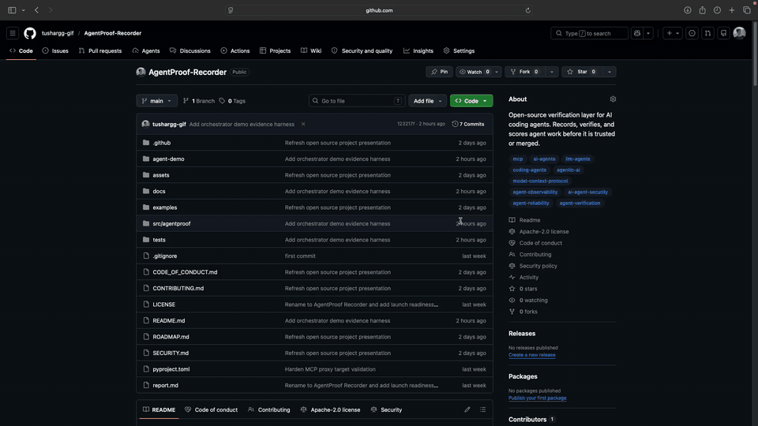

# AgentProof Recorder

<p align="center"><strong>Tamper-evident evidence for AI agent work.</strong></p>

<p align="center">
  AgentProof Recorder verifies whether agents followed policy, even when an agent claims it did —
  and can block unsafe access to sensitive files before it happens.
</p>

<p align="center">
  <a href="https://github.com/tushargg-gif/AgentProof-Recorder/actions/workflows/tests.yml"></a>
  <a href="LICENSE"></a>
  <a href="pyproject.toml"></a>
  <a href="https://github.com/tushargg-gif/AgentProof-Recorder/stargazers"></a>
</p>

<p align="center">
  <a href="https://raw.githubusercontent.com/tushargg-gif/AgentProof-Recorder/main/assets/demo.mp4">Demo Video</a> &middot;
  <a href="docs/quickstart.md">Docs</a> &middot;
  <a href="docs/quickstart.md">Quickstart</a> &middot;
  <a href="docs/examples.md">Examples</a> &middot;
  <a href="docs/security-model.md">Security Model</a> &middot;
  <a href="ROADMAP.md">Roadmap</a> &middot;
  <a href="CONTRIBUTING.md">Contributing</a>
</p>

AgentProof Recorder is a tamper-evident evidence layer for AI agent work. It records what agents actually did - file changes, commands, tests, policy decisions, MCP/tool calls, and final responses - then verifies that evidence against the task policy. With enforce mode it goes one step further and **blocks** reads, writes, and deletes of sensitive files in real time, before they can do harm.

> Early alpha: AgentProof Recorder is designed for local experimentation, agent-run evidence capture, and verification workflows. It does not claim to make local agents tamper-proof.
>
> Demo note: the Rogue Agent demo uses scripted Python agents for reproducibility. It does not call an LLM to choose policy or perform work. The real test is AgentProof Recorder's evidence capture, tamper-evident event chain, attribution, verification, and report generation.

## Demo: Rogue Agent Caught

<p align="center">
  <a href="https://raw.githubusercontent.com/tushargg-gif/AgentProof-Recorder/main/assets/demo.mp4">
    
  </a>
</p>

[Open the full MP4 demo](https://raw.githubusercontent.com/tushargg-gif/AgentProof-Recorder/main/assets/demo.mp4)

In the demo, a scripted Master Agent delegates documentation work to several scripted worker agents. Most workers stay inside their assigned scopes.

Then the Rogue Agent secretly changes `package.json`, while claiming no risky files changed. AgentProof checks the actual before-and-after file evidence, attributes `package.json` to the Rogue Agent, and returns:

```text
Final verdict: FAIL
Violating agent: Rogue Agent
Changed file: package.json
```

Run the same local demo:

```bash
python3 agent-demo/master_agent_demo.py --demo
```

Generated evidence:

- [agent-demo/generated/policy.json](agent-demo/generated/policy.json)
- [agent-demo/generated/events.jsonl](agent-demo/generated/events.jsonl)
- [agent-demo/generated/agentproof_report.json](agent-demo/generated/agentproof_report.json)

## Why This Matters

AI coding agents can claim success while:

- skipping required tests
- touching forbidden files
- modifying unrelated paths
- changing dependency files
- making unsafe tool calls
- producing output without evidence

The bottleneck is moving from writing code to verifying agent work. AgentProof Recorder gives reviewers local evidence before code moves into review or merge.

It does not replace CI, tests, or code review. It makes the handoff easier to inspect.

## Features

What AgentProof Recorder can do today.

### Evidence capture — record what the agent actually did

- Before/after file snapshots with a precise diff (added, modified, deleted)
- Command executions with exit codes, duration, and captured stdout/stderr
- Test detection and pass/fail results
- The agent's final response or summary
- Universal agent events (network requests, browser actions, artifacts) via `agentproof event`
- MCP / tool-call activity through a stdio proxy and an HTTP sidecar proxy
- Git context: branch, HEAD, dirty state, and start/end diffs

### Real-time enforcement — block before harm (opt-in `--enforce`)

- Denies **read, write, and delete** on sensitive paths (`.env`, `*.pem`, `*.key`, `id_rsa`, `credentials`, `secrets/`, …) before the operation lands
- Confines the agent's spawned process tree inside an OS sandbox — no kernel driver, EDR, or elevated privilege
- Backends: macOS `sandbox-exec` (verified) and Linux `bubblewrap` (experimental — not yet verified, see [security model](docs/security-model.md))
- **Fail-closed**: if no sandbox backend is available, recorded commands refuse to run rather than run unprotected
- Every allow/block is written to the tamper-evident chain as an `enforcement_decision`
- Uses the same sensitive-path definitions as the verifier, so what is blocked can never drift from what is flagged

### Verification — catch policy violations

- Forbidden path changes
- Unrelated / out-of-scope file changes
- Secret-like file changes
- Dependency / lockfile changes
- Missing or failed required tests, and missing regression tests
- Unapproved commands and failed commands
- Large diffs that need human review
- Unsafe network / browser events
- Forbidden MCP tools
- MCP targets pointing at local/private networks (SSRF guard)
- Local event-log tampering
- Custom, pluggable verifier checks

### Integrity & secret handling

- Append-only event log, SHA-256 **hash-chained** so any edit or reorder is detectable
- Chain verification surfaced as a first-class check in every report
- Automatic redaction of secret-like fields (authorization, api_key, token, password, cookie, …) before evidence is written to disk

### Scoring & reporting

- 0–100 score across weighted dimensions, plus a low/medium/high risk level
- Verdict: Pass / Partial Pass / Fail
- Markdown and JSON trust reports built for human review

### Orchestration & integration

- Local sidecar service (FastAPI) with optional bearer-token auth
- MCP stdio + HTTP proxy evidence capture for master agents and orchestrators
- Stable `agentproof` CLI, with an `agentproof-recorder` alias

## How It Works

```text
task contract -> guarded agent run -> evidence capture -> verification -> trust report
```

A task contract declares what the agent may touch and what success means. The agent
run is recorded (and, in enforce mode, confined). Evidence is captured into a
hash-chained log, verified against the contract, and summarized in a trust report.

## 60-Second Example

```bash
git clone https://github.com/tushargg-gif/AgentProof-Recorder
cd AgentProof-Recorder
pip install -e ".[dev]"

agentproof init
agentproof start --agent "claude-code"   # add --enforce to block sensitive-file access
agentproof run -- pytest
agentproof stop --final-response "Fixed auth bug"
agentproof verify
agentproof report --print
```

The package keeps the stable CLI command:

```bash
agentproof --help
```

It also installs the optional alias:

```bash
agentproof-recorder --help
```

## Example Report

```text
AgentProof Recorder Report

Verdict: Partial Pass
Score: 82/100
Risk: medium

Files changed: 2
Commands recorded: 1
Tests detected: yes
Policy violations: 0
Event chain: passed
Secret redaction: passed

Recommendation:
Safe for human review. Do not auto-merge without checking the diff.
```

A bad-agent example report is available at [report.md](report.md), with structured examples under [examples/](examples/). The local orchestrator demo publishes a current test-harness result at [agent-demo/RESULTS.md](agent-demo/RESULTS.md).

## Core Concepts

**Task contract**

A YAML file that says what the agent is allowed to touch, which commands count as evidence, and what success means.

**Evidence recorder**

Local run capture for file changes, command executions, final responses, universal events, and MCP/tool activity.

**Verification engine**

Checks the recorded run against the task contract and produces pass, partial pass, or fail results.

**Enforcement guard (optional)**

Runs the agent's commands inside an OS sandbox so reads, writes, and deletes of sensitive files are blocked in real time, not just flagged after the fact.

**Trust report**

Markdown and JSON output that summarizes score, risk, policy violations, changed files, commands, and observed events.

## Block Before Harm (Enforce Mode)

By default AgentProof Recorder *flags* sensitive-file access after the fact. With
`--enforce` it *prevents* it in real time:

```bash
agentproof start --agent "claude-code" --enforce
agentproof run -- python build.py     # reads/writes/deletes of .env, *.pem,
                                      # secrets/ … are blocked, not just logged
```

Because AgentProof launches the agent, it confines the **process tree it spawns**
inside an OS sandbox (`sandbox-exec` on macOS, `bubblewrap` on Linux) — no kernel
driver, EDR, or elevated privilege. Each decision is written to the tamper-evident
event chain as an `enforcement_decision`, and the mode is **fail-closed** (if no
sandbox backend is available, recorded commands refuse to run).

This is a guardrail against accidental/rogue access, not a containment boundary for
a fully attacker-controlled agent. See [docs/security-model.md](docs/security-model.md)
for backend details and limits.

## Local Sidecar And MCP Proxy

AgentProof Recorder can run as a local sidecar for a master agent or orchestrator:

```bash
agentproof sidecar --host 127.0.0.1 --port 8797 --root .agentproof
```

For sidecar APIs exposed beyond localhost, use an auth token:

```bash
agentproof sidecar --host 0.0.0.0 --port 8797 --auth-token "$AGENTPROOF_TOKEN"
```

MCP HTTP proxy targets are validated to reduce SSRF/local-network forwarding risk. You can also restrict proxy registration to known hosts:

```bash
agentproof sidecar --auth-token test --allowed-mcp-target-host mcp.example.com
```

Read more in [docs/mcp-proxy.md](docs/mcp-proxy.md) and [docs/security-model.md](docs/security-model.md).

## Documentation

- [Quickstart](docs/quickstart.md)
- [Task contracts](docs/task-contracts.md)
- [Verification model](docs/verification-model.md)
- [MCP proxy](docs/mcp-proxy.md)
- [Security model](docs/security-model.md)
- [Limitations](docs/limitations.md)
- [Examples](docs/examples.md)
- [Orchestrator demo results](agent-demo/RESULTS.md)

## Project Status

AgentProof Recorder is early alpha. The current focus is a useful local developer workflow:

- record coding-agent runs
- verify work against explicit task contracts
- block reads/writes/deletes of sensitive files in real time (macOS verified; Linux experimental)
- produce evidence reports for human review
- support MCP proxy evidence capture for orchestrators

See [ROADMAP.md](ROADMAP.md) for planned work.

## Repository Layout

```text
src/agentproof/        Python package. Import name stays agentproof.
tests/                 Automated tests.
docs/                  User and contributor documentation.
examples/              Good, bad, and MCP-focused example runs.
agent-demo/            Orchestrator demo test harness and publishable evidence.
.github/               CI, issue templates, and PR template.
.agentproof/           Local runtime evidence directory, created by the CLI.
```

## What AgentProof Recorder Is Not

AgentProof Recorder is not:

- a coding agent
- a replacement for CI
- a replacement for code review
- a full sandbox
- a hosted observability platform
- an insurance product
- a guarantee that agent output is correct
- tamper-proof storage

It is a local evidence and verification layer for agent work.

## Contributing

Contributions are welcome while the project is still small and sharp. Good first areas:

- more verifier checks
- adversarial bad-agent examples
- report readability
- MCP policy coverage
- GitHub/GitLab workflow integrations
- docs and task-contract templates

Read [CONTRIBUTING.md](CONTRIBUTING.md) before opening a pull request.

## Security

Do not open a public issue for sensitive vulnerabilities. Read [SECURITY.md](SECURITY.md) for reporting guidance.

## License

Apache-2.0. See [LICENSE](LICENSE).
